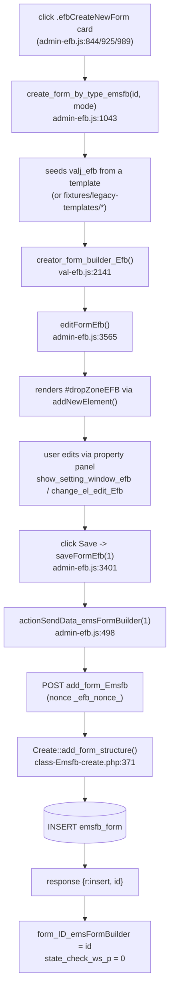
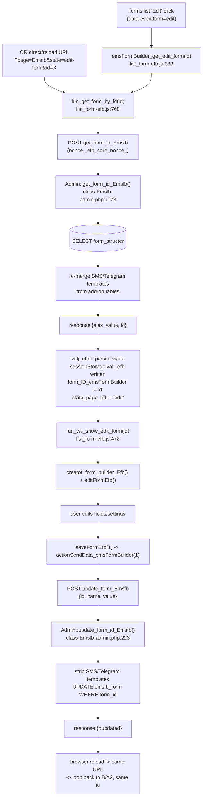
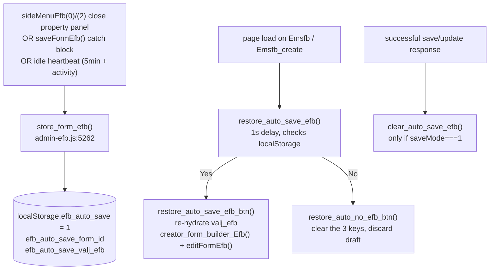
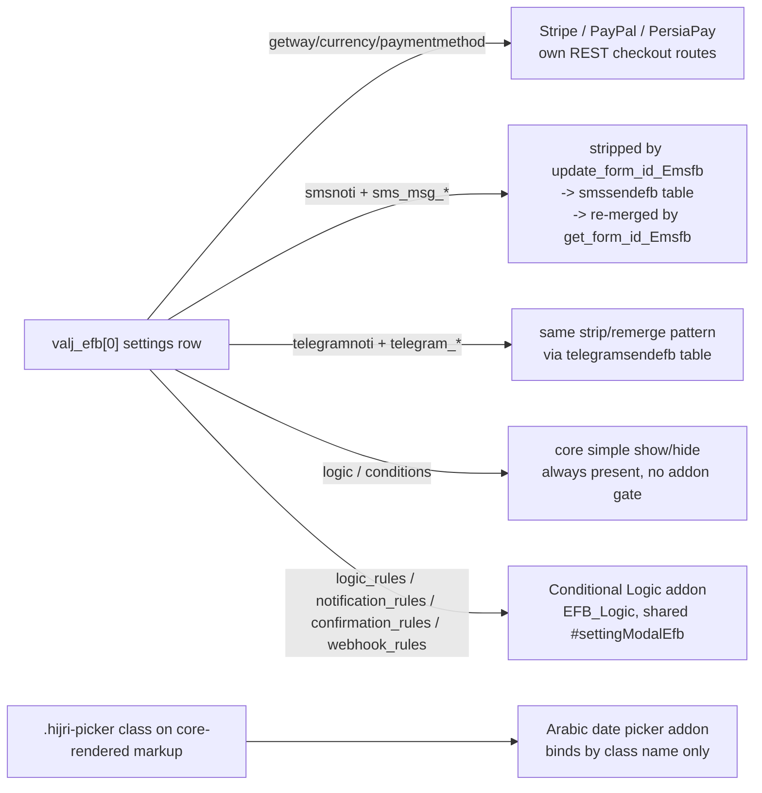

# DEPENDENCY_GRAPH.md — Closed Dependency Graph for Each Major Flow

Each flow below is closed: every arrow terminates at either a function documented in
ARCHITECTURE.md/AJAX_API.md, a global in GLOBAL_DEPENDENCIES.md, or an external dependency
explicitly called out as such (WP core, a CDN, or an add-on gated per ADDON_COMPATIBILITY.md).

## Create new form

## Edit existing form (load -> hydrate -> edit -> update -> reload)

## Autosave (client-only, no server round trip until an explicit save happens)

## Add-on entanglement (see ADDON_COMPATIBILITY.md for full detail)

## External, non-bundled dependencies (do not attempt to snapshot/bundle these)

WordPress core `jquery` handle, WordPress core `wp-pointer`, Google Fonts `Roboto` (remote CDN),
`countries-js` (remote CDN unless the Offline add-on's local copy is active), Bootstrap 5 bundle
JS (loaded, but its `Modal`/`bootstrap.Modal()` API is confirmed **never called** — all modal
behavior is hand-rolled, see ARCHITECTURE.md).
